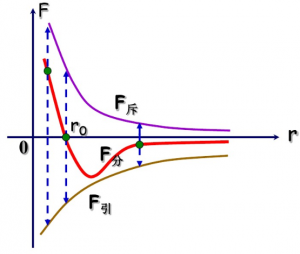
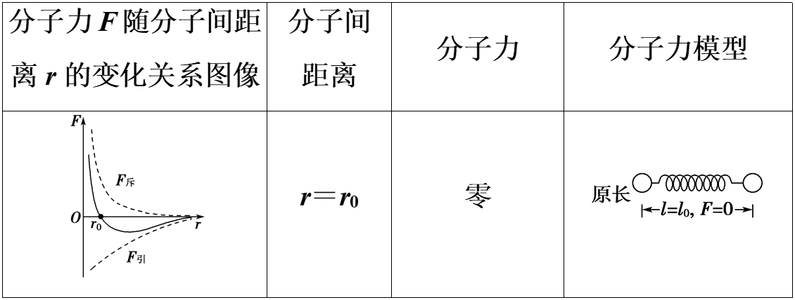
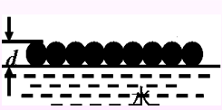
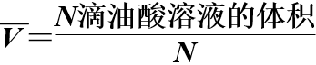
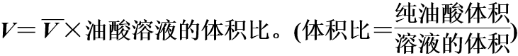
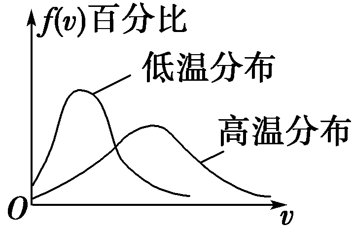

```
#format def
alias -->='确定'
alias \='#用于快速查看留的标签，无实际作用'
```
# 物理 #
## 分子运动\ ##
### 热运动 ####
- 定义:分子永不停息地做无规则运动
- 宏观表现
  - 扩散现象
  - 布朗运动
- 特征
  - 永不停息
  - (运动)无规则
  - 温度+;分子热运动+
#### 扩散 ####
- 现象:不同物质能够彼此进入对方的现象
- 原理:分子的无规则运动
- 意义:证明了分子永不停息地做无规则运动
- 特征:温度越高越明显
- 影响因素
  - 凝聚状态+
  - 温度+
  - 浓度差+
#### 布朗运动 ####
- 概念: __悬浮微粒__的无规则运动
- 原理:分子对悬浮颗粒撞击不平衡
- 特征:
  - 永不停息
  - 无规则
- 影响因素
  - 微利大小-
  - 温度+
### 分子间作用力 ###
- 分子间有空隙
  - 气体:气体易被压缩-->分子气体间空隙很大
  - 液体:水和酒精混合后总体积减少-->液体分子间有空隙
  - 固体:压在一起的金片和铅片的分子可互相扩散-->固体分子间有空隙
- 分子间作用力
  - 拉伸物体，物体内各部分间产生反抗拉伸的作用力，分子间作用力 ___表现___ 为引力
  - 压缩物体，物体内各部分间产生反抗压缩的作用力，分子间作用力 ___表现___ 为斥力
  - 分子力 引力和斥力的合力



-  分子间作用力与距离的关系!!!
     - 平衡位置：分子间距离r＝r0时，引力与斥力大小相等，分子力为零.平衡位置即分子间距离等于r0(数量级为10-10m)的位置.
     - 分子力与分子间距离变化的关系及分子力模型



#### sum ####
- 1. 内容：物体是由大量分子组成的，分子在做永不停息的无规则运动，分子之间存在着相互作用力。
- 2. 由于分子热运动是无规则的，对于任何一个分子都具有偶然性，但对大量分子的整体而言，表现出规律性。
### 「实验」用油膜法估测油酸分子的大小 ###
- 目标
  - 理解分子模型，知道分子直径的 ___数量级___.
  - 学会用油膜法估测分子大小
  - 能够对实验数据进行处理，掌握“互补法”计算油膜面积.
- 原理



  - 把一滴油酸酒精溶液滴在水面上，使油酸在水面上形成单分子油膜，则油膜厚度即为油酸分子的直径
- 步骤
  - 1. 在浅盘中倒入约2 cm深的水，将爽身粉均匀撒在水面上
  - 2. 用注射器往小量筒中滴入1 mL油酸酒精溶液，记下滴入的滴数n，算出一滴油酸酒精溶液的体积V0
  - 3. 将一滴油酸酒精溶液滴在浅盘的液面上
  - 4. 待油酸薄膜形状稳定后，将玻璃放在浅盘上，用水彩笔(或钢笔)画出油酸薄膜的形状
  - 5. 将玻璃放在坐标纸上，算出油酸薄膜的面积S；或者玻璃板上有边长为1 cm的方格，则也可通过数方格数，算出油酸薄膜的面积S
  - 6. 根据已配好的油酸酒精溶液的浓度，算出一滴油酸酒精溶液中纯油酸的体积V
  - 7. 计算油酸薄膜的厚度d＝V/S，即为油酸分子直径的大小
- 注意事项
  - 1. 实验前，必须把所有的实验用具擦洗干净，实验时吸取"油酸、酒精和溶液的移液管要分别专用，不能混用，否则会增大误差
  - 2. 待测油酸面扩散后又收缩，要在稳定后再画轮廓，扩散后又收缩有两个原因：一是水面受油酸液滴的冲击凹陷后又恢复；二是酒精挥发后液面收缩
  - 3. 本实验只要求估算分子大小，实验结果的数量级符合要求即可
  - 4. 爽身粉不宜撒得过厚，油酸酒精溶液的浓度以小于1/1 000为宜
  - 5. 向水面滴油酸酒精溶液时，应靠近水面，不能离水面太高，否则油膜轮廓难以形成
- 计算
  - 1. 一滴油酸溶液的平均体积



  - 2. 一滴油酸溶液中含纯油酸的体积



  - 3. 油膜的面积S＝n×1 cm²。(n为有效格数，小方格的边长为1 cm)
  - 4. 分子直径d＝V/S(代入数据时注意统一单位)
### 分子运动速率分布 ###
- 特点
  - 随机事件与统计规律
    - 统计规律：大量随机事件的整体往往会表现出一定的规律性，这种规律叫作统计规律
  - 气体分子运动的特点
    - 1. 运动的自由性
      - 由于气体分子间的距离比较大，分子间作用力很弱，通常认为，气体分子除了相互碰撞或者跟器壁碰撞外，不受力而做匀速直线运动，气体充满它能达到的整个空间
    - 2. 运动的无序性
      - 分子的运动杂乱无章，在某一时刻，向着任何一个方向运动的分子都有，而且向各个方向运动的气体分子数目几乎相等
- 分子运动速率分布图像



  - 规律
    - 1. 在一定温度下，不管个别分子怎样运动，气体的多数分子的速率都在某个数值附近，表现出“中间多、两头少”的分布规律
    - 2. 当温度升高时,分布规律不变,气体分子的速率增大,分布曲线的峰值向速率大的一方移动
  - 意义:温度越高，分子的热运动越剧烈
    - 说明：温度升高不是每个分子的速率都变大，而是速率大的占的百分比变大。
- 气体压强的微观解释
  - 原理:气体的压强是由气体中大量做无规则热运动的分子对器壁不断地碰撞产生的。压强就是在器壁单位面积上受到的压力
  - 影响因素

|宏观|微观|影响|
|-|-|-|
|温度|分子的平均速率|+|
|气体分子的数密度|单位体积的分子数|+|

 - 大气压强
   - 大气压强由气体的重力产生

|影响因素|效果|
|-|-|
|气体高度|-|
|~密度|+|

  - 气体压强分析
    - 明确气体压强产生的原因——大量做无规则运动的分子对器壁频繁、持续地碰撞.
    - 明确气体压强的决定因素——气体分子的数密度与平均速率
    - 两个因素的变化-->压强的变化，任何单个因素的变化都不能决定压强是否变化
### 分子动能和分子势能 ###

